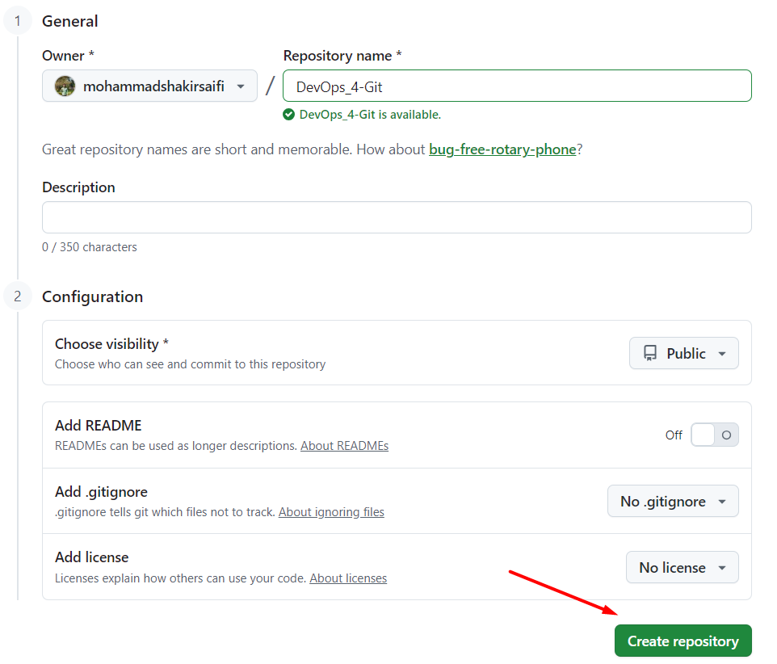
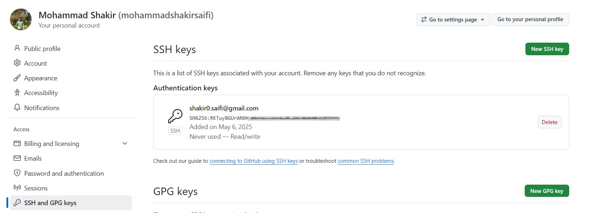
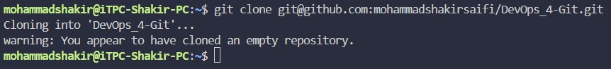
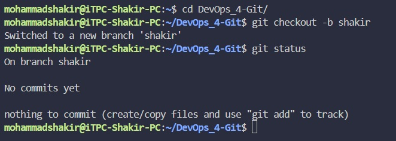
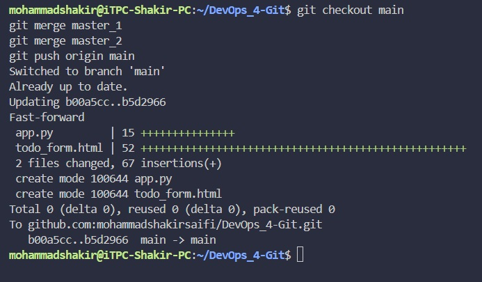
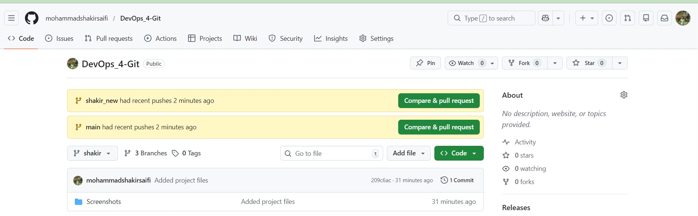
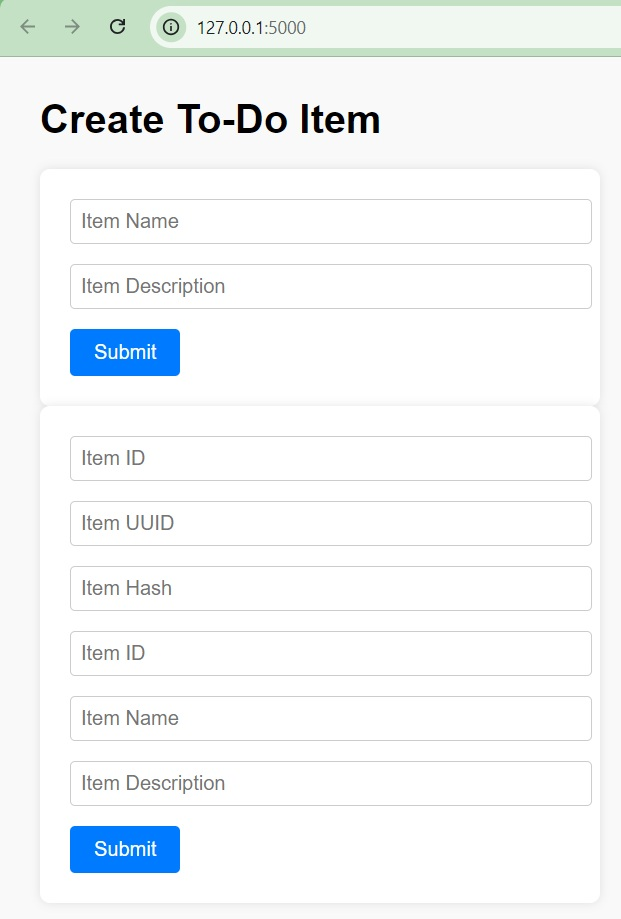

# Flask To-Do Application – Git & DevOps Assignment

---

## 📌 Project Overview

This project demonstrates end-to-end **Git workflows** along with a **Flask-based To-Do application** integrated with **MongoDB**.  
The assignment focuses on practical usage of Git branching, merging, conflict resolution, reset, and rebase operations, supported with screenshots.

---

## 🛠️ Technologies Used

- Python (Flask)
- HTML
- MongoDB
- MongoDB Compass
- Git & GitHub
- Ubuntu Linux

---

## 🌿 Branch Strategy

| Branch Name   | Purpose |
|--------------|--------|
| `main`       | Final stable branch |
| `shakir`     | Initial development branch |
| `shakir_new` | JSON update for `/api` route |
| `master_1`   | Frontend To-Do form |
| `master_2`   | Backend API & MongoDB |

---

## 🧩 Application Features

### Frontend
- To-Do form
- Fields include:
  - Item Name
  - Item Description
  - Item ID
  - Item UUID
  - Item Hash

### Backend
- `/submittodoitem` POST API
- Accepts form data
- Stores data in MongoDB (`todo_db → items`)

---

## 🗄️ MongoDB Integration

- MongoDB Server installed locally on Ubuntu
- Verified using MongoDB Compass
- Database auto-created on data insertion
- Successful record insertion confirmed

---

# 📸 Screenshots (Evidence of Work)

All screenshots are stored in the `Screenshots/` folder.

---

## 1️⃣ GitHub Repository Creation

---

## 2️⃣ SSH Key Configuration

---

## 3️⃣ Repository Clone (Using SSH)

---

## 4️⃣ Branch Creation

---

## 5️⃣ Commit History

---

## 6️⃣ Merge Operations

---

## 7️⃣ Conflict Resolution

---

## 8️⃣ Git Reset

---

## 9️⃣ Git Rebase

---

## 🔟 To-Do Form Output & MongoDB Insertion

---

## 📝 Assignment Highlights

- Proper Git branching model followed
- Feature branches merged into `main`
- Conflicts resolved correctly
- Reset and rebase performed without squashing commits
- MongoDB verified using Compass
- All steps supported with screenshots

---

## ✅ Conclusion

This project successfully demonstrates:
- Practical Git workflows
- Real-world branching and merging
- Safe reset and rebase operations
- A working Flask application with MongoDB integration
- Professional documentation with evidence

---

## 🔗 GitHub Repository

(Add your GitHub repository link here)
